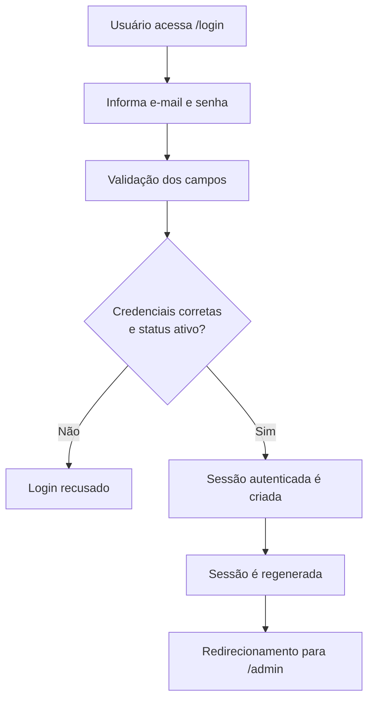
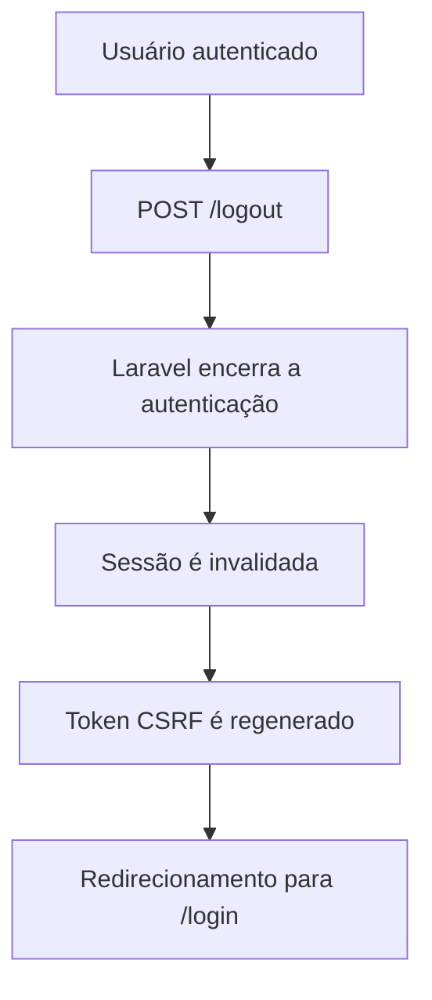
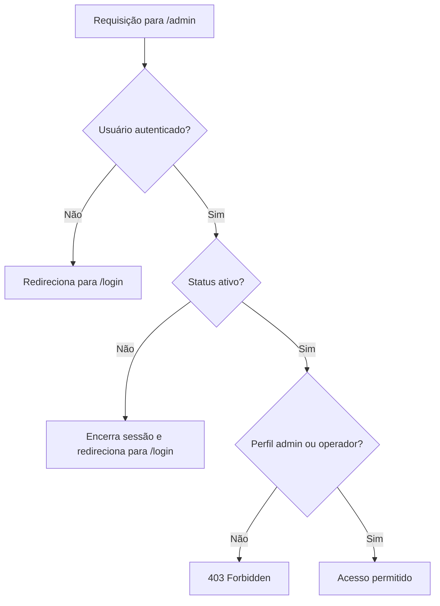

# Autenticação e Autorização

> **Escopo deste documento:** comportamento implementado no projeto após o primeiro sprint.  
> Este documento deve ser atualizado sempre que houver alterações no fluxo de login, perfis, status, permissões ou regras de acesso.

## 1. Objetivo

Este documento descreve o funcionamento da autenticação e da autorização da área administrativa da plataforma **Memórias Vivas**, registrando:

- como é criado o primeiro usuário;
- quais perfis de usuário existem;
- a diferença entre perfil e status;
- como funciona o login e o logout;
- como as rotas administrativas são protegidas;
- quais permissões estão definidas atualmente;
- decisões técnicas relevantes;
- testes relacionados ao controle de acesso;
- limitações e pendências conhecidas.

A documentação complementa a Especificação de Requisitos e o Dicionário de Dados do projeto e tem como objetivo facilitar a manutenção e a continuidade do sistema por futuras equipes.

---

## 2. Conceitos

### 2.1 Autenticação

A autenticação responde à pergunta:

> **Quem é o usuário?**

No estado atual da aplicação, usuários internos acessam a área administrativa utilizando **e-mail e senha**.

Após a validação das credenciais, o Laravel cria uma sessão autenticada para o usuário.

### 2.2 Autorização

A autorização responde à pergunta:

> **O que o usuário autenticado pode fazer?**

As permissões são determinadas principalmente pelo:

- perfil do usuário (`role`);
- status do usuário (`status`);
- middleware aplicado às rotas;
- Policies registradas para os recursos do sistema.

Autenticação e autorização são tratadas separadamente. Estar autenticado não significa, por si só, possuir permissão para executar qualquer ação administrativa.

---

## 3. Usuários internos

A tabela `users` possui, entre outros, os seguintes campos relacionados ao controle de acesso:

| Campo | Finalidade |
|---|---|
| `email` | Identificação utilizada no login |
| `password` | Senha do usuário, armazenada de forma protegida pelo Laravel |
| `role` | Define o perfil e as permissões do usuário |
| `status` | Define se a conta está ou não autorizada a acessar a área interna |
| `remember_token` | Suporte ao recurso de permanência da autenticação |

Atualmente, os valores aceitos para `role` e `status` são definidos diretamente na migration da tabela `users`.

---

## 4. Perfis de usuário

Atualmente existem dois perfis internos:

| Perfil | Valor armazenado | Finalidade |
|---|---|---|
| Administrador | `admin` | Administração geral do sistema e operações com permissões restritas |
| Operador | `operador` | Operações relacionadas principalmente à manutenção e catalogação do acervo |

### 4.1 Administrador

O administrador possui acesso às operações administrativas gerais e às ações que exigem privilégios elevados.

Entre as permissões atualmente definidas estão:

- gerenciamento de usuários;
- consulta de informações de auditoria de usuários;
- alteração de perfil e status de usuários;
- restauração de itens do acervo;
- exclusão definitiva de itens do acervo;
- todas as operações permitidas ao operador.

### 4.2 Operador

O operador é um usuário interno autorizado a trabalhar com o acervo.

As Policies atuais permitem ao operador realizar operações regulares relacionadas a:

- itens do acervo;
- arquivos digitais;
- categorias;
- assuntos;
- palavras-chave;
- pessoas;
- autores;
- coleções;
- conjuntos contextuais.

O operador não possui permissão para administrar outros usuários nem para executar operações reservadas ao administrador.

### 4.3 Visitante não é um perfil interno

O **Visitante** existe na Especificação de Requisitos como um ator externo da plataforma.

No estado atual do sistema, entretanto, ele **não é um valor válido do campo `role` da tabela `users`**.

Portanto:

- `admin` e `operador` representam contas autenticadas da área interna;
- visitantes utilizam a parte pública da plataforma sem serem representados como um perfil interno da tabela `users`.

---

## 5. Perfil x Status

Perfil e status possuem responsabilidades diferentes.

### Perfil (`role`)

O perfil responde:

> **Quais ações este usuário pode executar?**

Valores atuais:

```text
admin
operador
```

### Status (`status`)

O status responde:

> **Esta conta pode acessar o sistema neste momento?**

Valores atuais:

```text
ativo
inativo
```

### Combinações

| Perfil | Status | Resultado |
|---|---|---|
| `admin` | `ativo` | Pode acessar a área administrativa com permissões de administrador |
| `admin` | `inativo` | Não pode acessar a área administrativa |
| `operador` | `ativo` | Pode acessar a área administrativa com permissões de operador |
| `operador` | `inativo` | Não pode acessar a área administrativa |

O status é verificado independentemente do perfil. Dessa forma, um usuário pode ser temporariamente bloqueado sem que seu perfil precise ser alterado ou que seu cadastro seja removido.

---

## 6. Criação do primeiro usuário

### 6.1 Ambiente de desenvolvimento

No estado atual do projeto, o `DatabaseSeeder` cria um administrador inicial.

Ao executar as migrations com seed:

```bash
docker compose exec app php artisan migrate --seed
```

é criado um usuário com os seguintes dados:

```text
Nome: Administrador Memórias Vivas
E-mail: admin@memorias.test
Perfil: admin
Status: ativo
```

A senha utilizada atualmente é herdada da `UserFactory`:

```text
password
```

> **Atenção:** essas credenciais são destinadas somente ao ambiente de desenvolvimento. Elas são previsíveis e não devem ser utilizadas em produção.

### 6.2 Ambiente de produção

O procedimento definitivo para criação do primeiro administrador em produção **ainda deve ser definido**.

A solução adotada em produção não deverá depender de credenciais padrão presentes no código-fonte.

Possíveis alternativas a serem avaliadas futuramente incluem:

- comando Artisan específico para criação do primeiro administrador;
- configuração segura por variável de ambiente durante a implantação;
- procedimento administrativo executado diretamente no ambiente de produção.

A decisão final deverá ser registrada nesta documentação quando for implementada.

---

## 7. Fluxo de autenticação

As rotas atuais de autenticação estão definidas em `routes/web.php`.

### 7.1 Exibição do login

```http
GET /login
```

A rota utiliza o middleware `guest`, portanto é destinada a usuários não autenticados.

O controller responsável é:

```text
App\Http\Controllers\Auth\AuthenticatedSessionController
```

Método:

```text
create()
```

### 7.2 Envio das credenciais

```http
POST /login
```

O método `store()` valida:

- `email`: obrigatório e deve possuir formato de e-mail;
- `password`: obrigatório e deve ser uma string.

O formulário também pode enviar a opção `remember`.

A autenticação é realizada com:

```php
Auth::attempt([...$credentials, 'status' => 'ativo'], $remember)
```

Isso significa que o login somente é concluído quando:

1. o e-mail corresponde a um usuário existente;
2. a senha está correta;
3. o usuário possui `status = ativo`.

Caso alguma dessas condições não seja atendida, a autenticação é recusada.

A mensagem atual apresentada ao usuário é:

```text
As credenciais informadas não conferem ou o usuário está inativo.
```

A mensagem não informa separadamente se o problema ocorreu por senha incorreta ou por conta inativa.

### 7.3 Criação da sessão

Após uma autenticação bem-sucedida, a sessão é regenerada:

```php
$request->session()->regenerate();
```

Depois disso, o usuário é redirecionado para a rota originalmente pretendida ou, na ausência dela, para:

```text
/admin
```

### 7.4 Fluxo resumido



---

## 8. Logout

O logout é realizado pela rota:

```http
POST /logout
```

Essa rota exige que o usuário esteja autenticado por meio do middleware `auth`.

O método `destroy()` executa:

1. logout do guard `web`;
2. invalidação da sessão atual;
3. regeneração do token CSRF;
4. redirecionamento para `/login`.

Fluxo resumido:



---

## 9. Proteção da área administrativa

As rotas administrativas são agrupadas com os middlewares:

```php
['auth', 'admin.access']
```

Atualmente:

```http
GET /admin
```

é protegida por esse grupo.

### 9.1 Middleware `auth`

O middleware `auth` garante que exista um usuário autenticado.

Caso um visitante não autenticado tente acessar `/admin`, ele é redirecionado para `/login`.

### 9.2 Middleware `admin.access`

O alias `admin.access` aponta para:

```text
App\Http\Middleware\EnsureUserCanAccessAdminArea
```

Esse middleware realiza duas verificações.

#### Verificação 1 — usuário ativo

O middleware chama:

```php
$user->ativo()
```

Caso o usuário esteja inativo:

- sua autenticação é encerrada;
- a sessão é invalidada;
- o token CSRF é regenerado;
- o usuário é redirecionado ao login.

Isso também protege o sistema contra o caso em que um usuário já autenticado seja desativado posteriormente.

#### Verificação 2 — perfil interno

Depois da verificação do status, o middleware chama:

```php
$user->isPerfilInterno()
```

Atualmente são considerados perfis internos:

```text
admin
operador
```

Caso um usuário autenticado não possua um desses perfis, a aplicação retorna:

```http
403 Forbidden
```

### 9.3 Resultado das verificações



### 9.4 Middleware `active.user`

O projeto também possui o middleware:

```text
App\Http\Middleware\EnsureUserIsActive
```

registrado com o alias:

```text
active.user
```

Ele realiza exclusivamente a validação do status do usuário.

No estado atual das rotas administrativas, porém, o middleware utilizado é `admin.access`, que já verifica tanto o status quanto o perfil interno.

---

## 10. Modelo de autorização

As permissões específicas dos recursos são implementadas utilizando **Policies do Laravel**.

As Policies atualmente registradas são:

| Recurso | Policy |
|---|---|
| `User` | `UserPolicy` |
| `ItemAcervo` | `ItemAcervoPolicy` |
| `Arquivo` | `ArquivoPolicy` |
| `Categoria` | `SupportCatalogPolicy` |
| `Assunto` | `SupportCatalogPolicy` |
| `PalavraChave` | `SupportCatalogPolicy` |
| `Pessoa` | `SupportCatalogPolicy` |
| `Autor` | `SupportCatalogPolicy` |
| `Colecao` | `SupportCatalogPolicy` |
| `ConjuntoContextual` | `SupportCatalogPolicy` |

O registro dessas Policies é feito em:

```text
app/Providers/AppServiceProvider.php
```

### 10.1 Regras compartilhadas

O trait:

```text
App\Policies\Concerns\ChecksRoleAccess
```

centraliza duas verificações:

```php
internal($user)
```

Retorna verdadeiro quando o usuário:

- está ativo;
- possui perfil `admin` ou `operador`.

```php
admin($user)
```

Retorna verdadeiro quando o usuário:

- está ativo;
- possui perfil `admin`.

Essa centralização evita repetir as mesmas verificações em todas as Policies.

---

## 11. Matriz de permissões atual

> A tabela abaixo representa as **regras de autorização definidas nas Policies atuais**. Algumas dessas ações podem ainda não possuir tela ou rota disponível na interface.

### 11.1 Itens do acervo

| Ação | Administrador | Operador |
|---|:---:|:---:|
| Listar | ✅ | ✅ |
| Visualizar | ✅ | ✅ |
| Criar | ✅ | ✅ |
| Atualizar | ✅ | ✅ |
| Alterar visibilidade | ✅ | ✅ |
| Excluir | ✅ | ✅ |
| Restaurar | ✅ | ❌ |
| Excluir definitivamente | ✅ | ❌ |

### 11.2 Arquivos digitais

| Ação | Administrador | Operador |
|---|:---:|:---:|
| Listar | ✅ | ✅ |
| Visualizar | ✅ | ✅ |
| Criar | ✅ | ✅ |
| Enviar original | ✅ | ✅ |
| Atualizar | ✅ | ✅ |
| Substituir original | ✅ | ✅ |
| Excluir | ✅ | ✅ |

### 11.3 Cadastros de apoio

A `SupportCatalogPolicy` é utilizada atualmente para:

- categorias;
- assuntos;
- palavras-chave;
- pessoas;
- autores;
- coleções;
- conjuntos contextuais.

| Ação | Administrador | Operador |
|---|:---:|:---:|
| Listar | ✅ | ✅ |
| Visualizar | ✅ | ✅ |
| Criar | ✅ | ✅ |
| Atualizar | ✅ | ✅ |
| Excluir | ✅ | ✅ |

### 11.4 Usuários

| Ação | Administrador | Operador |
|---|:---:|:---:|
| Listar usuários | ✅ | ❌ |
| Visualizar usuário | ✅ | ❌ |
| Criar usuário | ✅ | ❌ |
| Atualizar usuário | ✅ | ❌ |
| Alterar dados de identificação | ✅ | ❌ |
| Alterar perfil | ✅ | ❌ |
| Alterar status | ✅ | ❌ |
| Consultar auditoria | ✅ | ❌ |
| Alterar a própria senha | ✅ | ✅ |
| Alterar a senha de outro usuário | ❌ | ❌ |

---

## 12. Proteção do último administrador ativo

Existe uma regra específica na `UserPolicy` para impedir que o sistema fique sem nenhum administrador ativo.

Quando um usuário é simultaneamente:

```text
role = admin
status = ativo
```

e não existe outro administrador ativo no banco de dados, esse usuário não pode:

- ter seu perfil alterado para `operador`;
- ter seu status alterado para `inativo`.

Quando existe pelo menos outro administrador ativo, essas alterações passam a ser permitidas pela Policy.

Essa regra evita que a própria administração do sistema remova acidentalmente todos os usuários capazes de gerenciar contas e permissões.

---

## 13. Senhas

O model `User` utiliza o cast:

```php
'password' => 'hashed'
```

Dessa forma, valores atribuídos ao campo `password` são tratados pelo mecanismo de hash fornecido pelo Laravel antes de serem armazenados.

O model também oculta os campos:

```text
password
remember_token
```

em representações serializadas.

### 13.1 Alteração de senha

A `UserPolicy` determina que usuários internos ativos podem alterar **a própria senha**.

A mesma Policy não autoriza um usuário a alterar diretamente a senha de outro usuário, inclusive quando o solicitante é administrador.

### 13.2 Recuperação de senha

A migration inicial cria a tabela:

```text
password_reset_tokens
```

e a `UserPolicy` já possui uma autorização chamada:

```text
resetOwnPassword
```

Entretanto, no estado atual do projeto enviado, **não existem rotas e controller implementando o fluxo completo de recuperação de senha**.

Portanto, a recuperação de senha permanece como funcionalidade pendente.

---

## 14. Decisões técnicas registradas

### DT-01 — Autenticação por sessão

A área administrativa utiliza o sistema de autenticação por sessão do Laravel.

Essa abordagem é adequada ao formato atual da aplicação web, na qual o usuário acessa páginas da própria plataforma e mantém uma sessão autenticada no navegador.

### DT-02 — Somente usuários ativos podem autenticar

O status `ativo` é incluído diretamente na tentativa de autenticação.

Isso impede que um usuário marcado como `inativo` obtenha uma nova sessão mesmo que informe e-mail e senha corretos.

### DT-03 — Usuários já autenticados também têm o status revalidado

O middleware `admin.access` verifica novamente o status a cada acesso às rotas protegidas por ele.

Assim, caso um usuário seja desativado enquanto já possui uma sessão aberta, seu acesso é encerrado na próxima requisição à área administrativa.

### DT-04 — Perfil e status são independentes

O projeto mantém `role` e `status` em campos separados.

Essa decisão permite suspender temporariamente uma conta sem alterar suas permissões originais ou excluir seu cadastro.

### DT-05 — Visitantes não são contas administrativas

Embora Visitante seja um ator previsto nos requisitos do sistema, o modelo atual de usuários internos aceita apenas `admin` e `operador`.

O acesso público deverá ser tratado separadamente da autenticação administrativa.

### DT-06 — Policies centralizam as permissões por recurso

As regras de autorização são centralizadas em Policies, evitando que verificações de perfil fiquem espalhadas por controllers e outras partes do sistema.

### DT-07 — Regras comuns de perfil são reutilizadas

As Policies utilizam o trait `ChecksRoleAccess` para centralizar as verificações de usuário interno e administrador.

### DT-08 — O último administrador ativo é protegido

A `UserPolicy` impede que o último administrador ativo seja rebaixado ou desativado.

### DT-09 — Administração de usuários é exclusiva do administrador

As operações de gerenciamento de usuários e consulta de auditoria são reservadas ao perfil `admin`.

Operadores podem apenas executar ações relacionadas à própria senha previstas pela Policy.

---

## 15. Testes automatizados relacionados

O projeto possui testes de Feature específicos para autenticação e controle de acesso.

### `tests/Feature/AdminAuthenticationTest.php`

Atualmente cobre comportamentos como:

- página de login acessível;
- visitante redirecionado ao tentar acessar `/admin`;
- redirecionamento da página inicial;
- autenticação de usuário interno ativo;
- acesso de operador ativo à área administrativa;
- bloqueio de perfil não interno;
- impedimento de login de usuário inativo;
- encerramento do acesso de usuário que esteja autenticado mas inativo;
- logout;
- bloqueio da área administrativa após logout.

### `tests/Feature/ProfileAccessControlTest.php`

Atualmente cobre comportamentos como:

- permissões regulares de administrador e operador sobre itens do acervo;
- restauração e exclusão definitiva restritas ao administrador;
- permissões sobre arquivos;
- permissões sobre cadastros de apoio;
- gerenciamento de usuários restrito ao administrador;
- proteção do último administrador ativo;
- impedimento de alteração da senha de outro usuário;
- permissão para usuários internos gerenciarem a própria senha;
- bloqueio das Policies para usuários inativos;
- integração das Policies com middleware `can`.

Para executar toda a suíte de testes no ambiente Docker:

```bash
docker compose exec app php artisan test
```

Para executar somente os testes relacionados a esta documentação:

```bash
docker compose exec app php artisan test tests/Feature/AdminAuthenticationTest.php
docker compose exec app php artisan test tests/Feature/ProfileAccessControlTest.php
```

---

## 16. Arquivos relevantes

Os principais arquivos relacionados ao fluxo documentado são:

```text
routes/web.php

app/Models/User.php

app/Http/Controllers/Auth/AuthenticatedSessionController.php

app/Http/Middleware/EnsureUserCanAccessAdminArea.php
app/Http/Middleware/EnsureUserIsActive.php

app/Policies/Concerns/ChecksRoleAccess.php
app/Policies/UserPolicy.php
app/Policies/ItemAcervoPolicy.php
app/Policies/ArquivoPolicy.php
app/Policies/SupportCatalogPolicy.php

app/Providers/AppServiceProvider.php

database/migrations/0001_01_01_000000_create_users_table.php
database/factories/UserFactory.php
database/seeders/DatabaseSeeder.php

tests/Feature/AdminAuthenticationTest.php
tests/Feature/ProfileAccessControlTest.php
```

---

## 17. Requisitos relacionados

Esta implementação está relacionada principalmente aos seguintes pontos definidos na Especificação de Requisitos do Sistema:

- autenticação de usuários;
- gerenciamento de usuários;
- controle de permissões;
- segurança de autenticação;
- segurança de acesso.

O sistema prevê Administrador e Operador como atores internos, com responsabilidades distintas, e estabelece que funcionalidades administrativas e materiais restritos devem ser acessados somente por usuários autorizados.

---

## 18. Pendências e pontos de evolução

No estado atual do projeto, permanecem como pontos a definir ou implementar:

- procedimento seguro para criação do primeiro administrador em produção;
- implementação completa da recuperação de senha;
- disponibilização das telas e rotas correspondentes às permissões já definidas nas Policies;
- avaliação de limitação de tentativas de login;
- revisão desta matriz de permissões conforme novas funcionalidades forem implementadas;
- atualização deste documento sempre que um novo perfil, status, middleware ou regra de autorização for criado.

---

## 19. Regra de manutenção desta documentação

Sempre que uma alteração modificar qualquer um dos itens abaixo, este documento deverá ser revisado no mesmo ciclo de desenvolvimento:

- campos `role` ou `status`;
- fluxo de login ou logout;
- criação de usuários;
- middlewares de autenticação ou acesso;
- Policies;
- permissões de Administrador ou Operador;
- gerenciamento ou recuperação de senhas;
- regras relacionadas ao bloqueio de usuários;
- testes de autenticação e autorização.

A documentação deve representar o **comportamento efetivamente implementado**, e não apenas funcionalidades planejadas.
